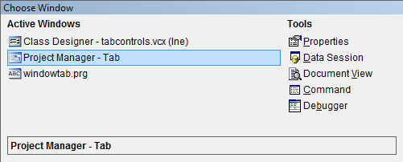

# Tabbing Navigation
**Makes navigating through FoxPro the same experience as SQL Management Studio or Visual Studio**

Project Manager: Sven Johannsen ([Johannsen@tmn-systemberatung.de](mailto:Johannsen@tmn-systemberatung.de))

Make navigating through FoxPro the same experience like in SQL Management Studio or Visual Studio.

The included source code is tested with Visual FoxPro 9 SP2. It includes a project file to create a runtime binary. The TabbingNavigation.APP file was created with the belonging project and includes all its stuff (graphics, code, etc). Therefore you can copy it everywhere to run. It has to be called once in your development environment or within your application. Just execute following line to register the tab key in the current VFP instance:

    Do PathToProject\TabbingNavigation.App with .t.

Afterwards the keys Ctrl+Tab should result in a selection window.

New in this release is the possibility to change the shortcut key and font used in this tool. The attached Ini-file will be extended for more settings in future releases. Further restrictions which made the tool not working in EXE files were abolished, too.